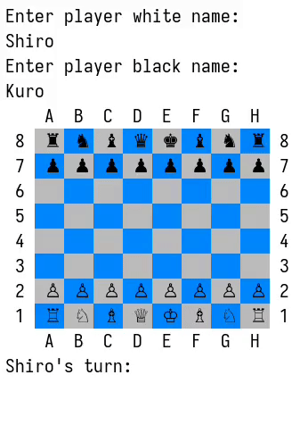

# chess-ruby
Command Line Interface (CLI) Implementation of Classic Chess Game using Ruby

## Preview

## Feature
- Colored board
- Prevent players from making illegal moves
- Display a warning when the King is in check
- Checkmate detection
- Support **Pawn Promotion**, **En Passant**, and **Castling**
- Function to save game to './save.data'
- [to do] AI player
- [to do] Support algebraic notation

## How to play
### 

or

### Run locally
Clone this repo and run `main.rb` with ruby. You must have ruby installed (version 3.2.2 or newer)

## Additional notes
This project is part of The Odin Project course [Project: Ruby Final Project](https://www.theodinproject.com/lessons/ruby-ruby-final-project)

